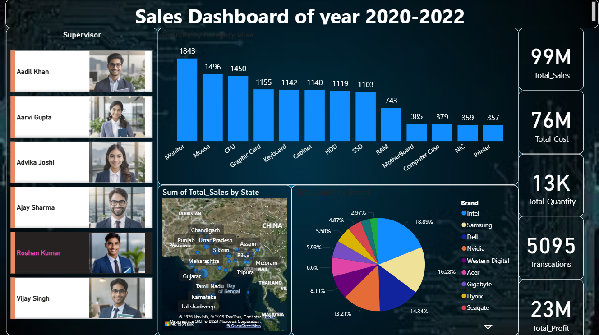

# PowerBI-Sales-Analytics-Project

**About this project**
This project is a Sales Analytics Dashboard built using Power BI to analyze business performance and extract actionable insights from raw sales data. The dashboard focuses on understanding sales trends, profitability, and category-wise performance to support better decision-making.

**Project Objective**
The main objective of this project is to:
-Analyze sales performance over time
-Identify top-performing products/categories
-Understand profit and revenue trends
-Present data in an interactive and easy-to-understand dashboard

**Tools used**
Microsoft Power BI
Excel / CSV file (data source)
Power Query (Data Cleaning & Transformation)
Basic DAX Measures

**Dashboard Preview**

**Key Insights**
Identified overall sales and profit performance using KPIs
Found sales trends across different time periods
Analyzed category-wise contribution to revenue
Highlighted top-performing segments/products
Used filters and slicers for interactive exploration

**What I worked on**
Cleaned and transformed raw sales data using Power Query
Built interactive visualizations (charts, KPIs, slicers)
Designed a structured and user-friendly dashboard layout
Created measures for key business metrics
Focused on making insights simple and visual

**What I learned**
Through this project, I learned:
How to work with real-world datasets
How to design effective dashboards
How businesses use data for decision-making
Basics of data modeling and visualization in Power BI

**Project files**
dashboard.pbix → Power BI file
dataset.csv → raw data (if included)
images/ → dashboard screenshot

**Note**
This is a beginner-friendly project, but it helped me understand how data analysis works in real business scenarios.
important piint is not highlighting
